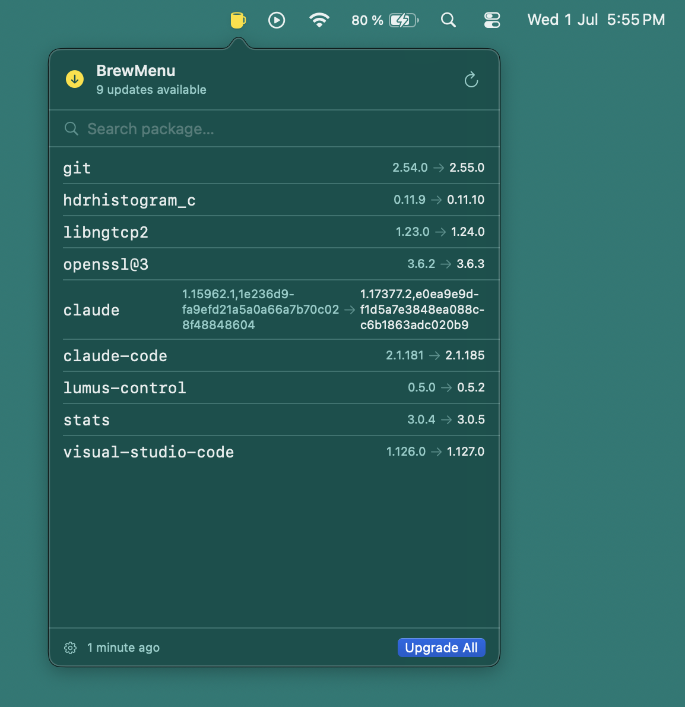

# BrewMenu

A native macOS menu bar app that monitors Homebrew health in the background.

BrewMenu is not a CLI wrapper with a GUI. It watches your Homebrew installation over time — outdated packages, doctor warnings, pending cleanups, stopped services — and surfaces that information passively from the menu bar.



## Features

- Outdated package list with installed and available versions
- `brew upgrade` with real-time streaming output and cancel support
- `brew doctor` integration — warnings and errors surfaced in the popover
- Service monitor — view and start/stop Homebrew services
- Insights engine — detects stale updates, cleanup opportunities, abandoned casks, and more
- Configurable check frequency (hourly, every 6 hours, daily, or manual)
- Native notifications for new updates, doctor warnings, upgrade failures, and completions
- Badge count on the menu bar icon showing number of pending updates
- English and Spanish, following system language
- Logs to `~/Library/Application Support/BrewMenu/logs/brewmenu.log` with 5 MB rotation

## Requirements

- macOS 14 (Sonoma) or later
- Homebrew installed at `/opt/homebrew` (Apple Silicon), `/usr/local` (Intel), or a custom path

## Installation

```bash
brew install --cask dotfn/tap/brewmenu
```

To update:

```bash
brew upgrade --cask brewmenu
```

## Building from source

Requires Xcode Command Line Tools or Xcode.

```bash
git clone https://github.com/dotfn/brewmenu.git
cd brewmenu
swift build
```

To assemble a release `.app` bundle:

```bash
./scripts/build-release.sh 1.0.0
```

This produces `build/BrewMenu-1.0.0.zip` with an ad-hoc signed `.app`.

Tests (unit only — integration tests that call real `brew` are in a separate target):

```bash
swift test
```

## Project layout

```
Sources/
  BrewMenuApp/        @main, MenuBarExtra, scene composition
  Features/
    MenuBar/          Popover UI and view model
    Settings/         Preferences window
    Notifications/    UserNotifications wrappers
  Services/
    BrewService       Single point that executes brew. Actor.
    EnvironmentResolver   Detects brew path and shell environment
    StatusChecker     Periodic check scheduling
    HistoryStore      Snapshot persistence (JSON, 30-day rotation)
    InsightEngine     Pure function: [Snapshot] -> [Insight]
  Models/             OutdatedPackage, Snapshot, Insight, etc.
Tests/
  BrewMenuTests/              Unit tests, no real brew
  BrewMenuIntegrationTests/   Call real brew, skipped in CI
```

## License

MIT
