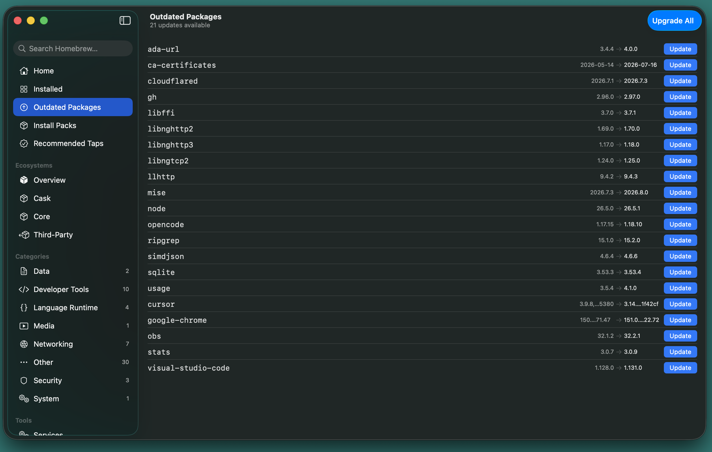

# BrewMenu

A native macOS menu bar app that turns Homebrew into something you can actually see. It watches your installation in the background — outdated packages, doctor warnings, pending cleanups, stopped services — and gives you a full dashboard for browsing, installing, and managing packages without touching the terminal.



## Features

### Menu bar popover
- Badge on the menu bar icon showing the number of pending updates
- Outdated package list with installed vs. available versions
- `brew upgrade` with real-time streaming output, per-package or all-at-once, with cancel support
- `brew doctor` integration — warnings and errors surfaced inline
- Cleanup and unused-dependency (`brew autoremove`) actions with dry-run byte estimates
- Service monitor — view running/stopped services, start/stop them, auto-refreshes every 30s while the popover is open (polling stops when it's closed, to avoid draining battery)
- Insights engine — detects stale updates, a doctor check that hasn't run recently, cleanup opportunities, abandoned casks, unused dependencies, accumulated updates, and services that went down
- Restart banner when BrewMenu upgrades itself via `brew upgrade`

### Dashboard window
A full window (⌘-openable, separate from the popover) for browsing and managing your Homebrew setup:
- **Home** — overview stats, active ecosystems, quick links
- **Installed** — every installed formula/cask, browsable by auto-classified category (Developer Tools, Security, Data, Media, etc.)
- **Outdated Packages**, **Services**, **Doctor Warnings**, **Insights**
- **Install Packs** — curated one-click bundles (Dev Essentials, Web Dev, DevOps, Data Tools, Security, Mac Essentials, AI Dev Tools, Chef's Suggestion), seeded from `Sources/Resources/InstallPacks.json`
- **Recommended Taps** — reputable third-party taps (HashiCorp, 1Password CLI, Supabase CLI, yabai/skhd, SketchyBar, etc.) enable in one click, seeded from `Sources/Resources/RecommendedTaps.json`
- **Ecosystems** — every tap (official + third-party), each showing its packages and install counts
- **Search** — live `brew search`, with an "Add" field that accepts a bare package name, a `user/repo/name` package, or a `user/repo` tap and figures out which one you meant
- **Package detail** — description, homepage, requirements, deprecation/disable status, and 30/90/365-day install popularity, pulled from formulae.brew.sh
- Settings — check frequency, launch at login, update badge, hide menu bar icon when nothing needs attention, per-category notification toggles, custom Homebrew path, reset all data

### Behavior
- Checks run hourly by default (configurable: hourly / every 6h / daily / manual); `brew doctor` and cask inventory run on their own slower cadence (24h / 6h) piggybacked on the regular check
- Snapshots are kept for 30 days and drive the insights engine
- Native notifications for new updates, doctor warnings, critical insights, and upgrade completion/failure — each throttled so they don't flood
- Logs to `~/Library/Application Support/BrewMenu/logs/brewmenu.log`, 5 MB rotation
- English and Spanish, following system language

## Requirements

- macOS 15 (Sequoia) or later
- Homebrew installed at `/opt/homebrew` (Apple Silicon), `/usr/local` (Intel), or a custom path set in Settings

## Installation

```bash
brew install --cask dotfn/tap/brewmenu
```

To update:

```bash
brew upgrade --cask brewmenu
```

### Unattended install

`scripts/install.sh` installs Homebrew (if missing) and BrewMenu in one shot — useful for onboarding new users without walking them through Homebrew setup first:

```bash
curl -fsSL https://raw.githubusercontent.com/dotfn/brewmenu/main/scripts/install.sh | bash
```

## Building from source

Requires Xcode Command Line Tools or Xcode.

```bash
git clone https://github.com/dotfn/brewmenu.git
cd brewmenu
swift build
```

To assemble a release `.app` bundle (ad-hoc signed, zipped):

```bash
./scripts/build-release.sh 1.0.0
```

This produces `build/BrewMenu-1.0.0.zip`.

### Tests

```bash
swift test   # 228 tests, Swift Testing framework — no real brew calls
```

## Release process

Pushing a `v*` tag runs `.github/workflows/release.yml`:
1. Builds and ad-hoc signs the `.app` via `scripts/build-release.sh`
2. Publishes a GitHub release with the zip attached
3. Updates the `dotfn/homebrew-tap` cask (`Casks/brewmenu.rb`, generated from `scripts/brewmenu.rb.tpl`) with the new version and sha256, if `TAP_TOKEN` is set

## Project layout

```
Sources/
  App/                 @main, MenuBarExtra + Dashboard window scene, app icon,
                        notification delegate, self-upgrade relauncher, dashboard navigation
  Features/
    MenuBar/            Popover UI and view model
    Dashboard/           Full-window UI: Home, Installed, Ecosystems, Search,
                          Install Packs, Recommended Taps, package detail, per-view models
    Settings/            Preferences window
    Onboarding/          First-run setup (detect brew, notifications permission)
    Notifications/       UserNotifications wrapper (BrewNotifier)
  Services/
    BrewService          Single point that executes brew. Actor. Conforms to BrewServicing.
    EnvironmentResolver   Detects brew path and shell environment
    StatusChecker         Periodic check scheduling (updates, doctor, services, casks)
    HistoryStore          Snapshot persistence (JSON, 30-day rotation)
    InsightEngine         Pure function: [Snapshot] -> [Insight]
    HomebrewAPIClient     Talks to formulae.brew.sh (trending packages, descriptions,
                           package detail) — the app's only network dependency
    InstalledPackagesCache  Stale-while-revalidate cache so the Dashboard paints instantly
    SettingsStore          Persists AppSettings to disk
    BrewLogger              Rotating file logger
    ProcessRunner            Subprocess execution wrapper
  Models/               OutdatedPackage, Snapshot, Insight, InstalledPackage, Tap,
                        InstallPack, RecommendedTap, SearchResult, ResolvedPackage,
                        PackageDetail, TrendingPackage, PackageCategory, etc.
Tests/
  BrewMenuTests/              Unit tests (Swift Testing), no real brew calls
scripts/
  install.sh            Unattended installer (Homebrew + BrewMenu)
  build-release.sh       Builds and zips a signed release .app
  brewmenu.rb.tpl        Cask template used by the release workflow
```

## License

MIT
